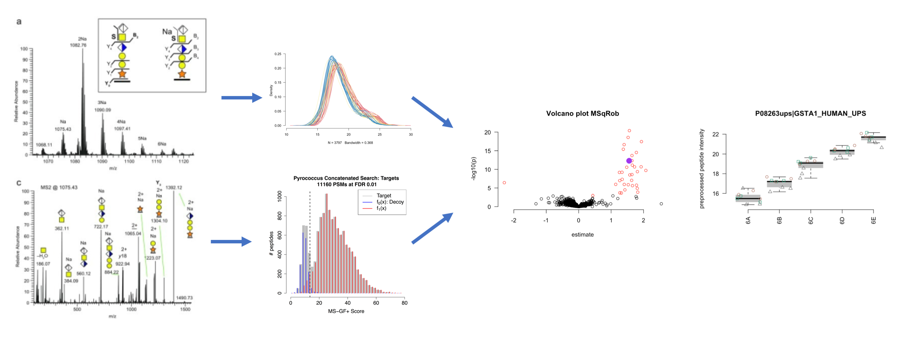

```{r setup, include=FALSE, cache=FALSE}
knitr::opts_chunk$set(echo = FALSE)
```

***

```{r echo=FALSE}

```


### Target Audience

- This course is oriented towards biologists and bioinformaticians with a particular interest in differential analysis for quantitative proteomics.

- We assume that the participants already know the basics on preprocessing and statistical testing in proteomics data analysis. 

- These prerequisites can be revisited in our two hour introductory course on proteomics data analysis: [https://statomics.github.io/PDA21/](https://statomics.github.io/PDA21/)


### Software & Data 

Many software tools exist for differential proteomics data analysis, e.g. 

- MaxQuant - Perseus
- MSstats
- DEqMS
- msqrob2

Here, we will illustrate all concepts using the msqrob2 software. 
The software can be used with R/Rmarkdown scripting or with a Graphical User Interface (GUI).

- [Install msqrob2 software](./software.html)
- [Download data](https://github.com/statOmics/PDA21/archive/refs/heads/data.zip)

Note, that users who develop R/markdown scripts can access data both from the web or from disk within their scripts. So they do not need to download the data first. The msqrob2gui Shiny App only works with data that is available on disk.  

- More information on our tools can be found in our papers [@goeminne2016], [@goeminne2020] and [@sticker2020]. Please refer to our work when using our tools. 


### Instructor

- [Lieven Clement](https://statomics.github.io/pages/about.html), Associate Professor of Statistical Genomics, [statOmics](https://statomics.github.io/), [Ghent University](https://www.ugent.be/), Belgium


---

### Detailed Program


  1. Sources of variability in label-free proteomics experiments:  [lecture](./sourcesOfVariability.html), [[PDF](./sourcesOfVariability.pdf)]
  2. Experimental design concepts for proteomics data analysis
  
---

### Acknowledgements 

A special thanks to Pedro Fernandes, Coordinator of the GTPB Bioinformatics Training Programme, Instituto Gulbenkian de Ciencia, who radically changed our view on teaching and immersed us in the teaching method that we use in this course.

### License

<a rel="license" href="https://creativecommons.org/licenses/by-nc-sa/4.0"></a>

This project is licensed under the [Creative Commons Attribution-NonCommercial-ShareAlike 4.0 International (CC BY-NC-SA 4.0)](https://creativecommons.org/licenses/by-nc-sa/4.0)

---

### References 

